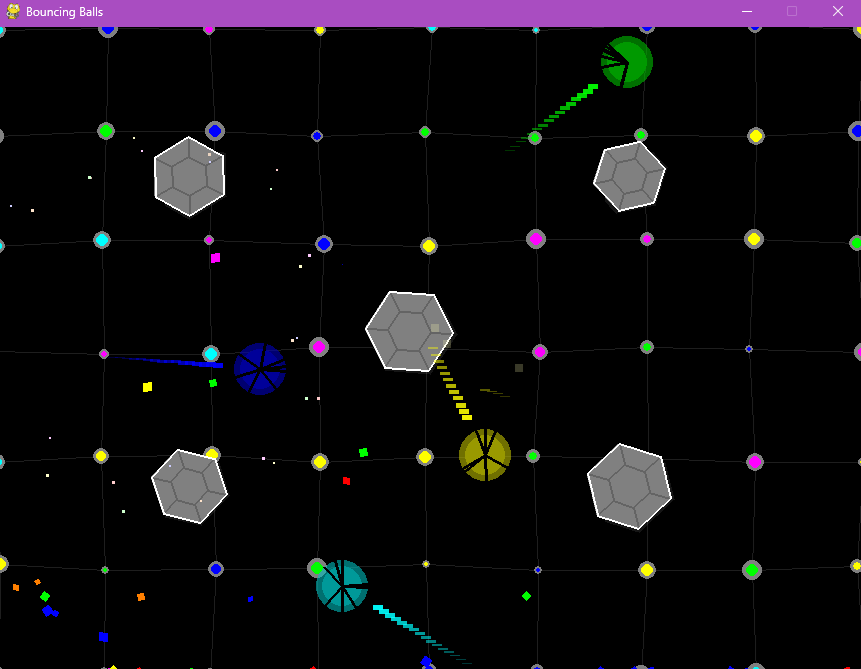

# Bouncing Balls

A simple Pygame project demonstrating bouncing balls with collision and explosion effects.

## Features

- Multiple bouncing balls
- Collision detection
- Explosion effects with particles
- Colorful visuals

## Screenshot



## Requirements

- Python 3.x
- Pygame

## Installation

1.  Make sure you have Python 3.x installed.
2.  Install Pygame:

    ```bash
    pip install pygame
    ```

## Usage

Run the `main.py` file.

```bash
python main.py